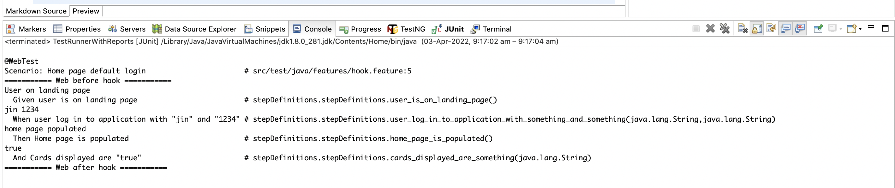

# installation and configs
1. add cucumber eclipse plugin in eclipse by going to market place. <br>
2. create a new project choose maven archetype -> quick start <br>
3. once project created, right click, configure -> convert into a cucumber project. <br>
4. in pom.xml add dependencies of cucumber-java and cucumber-junit

# Plugin to generate step definitions from feature file.
copy feature file contents to the plugin click generate
https://chrome.google.com/webstore/detail/tidy-gherkin/nobemmencanophcnicjhfhnjiimegjeo/related?hl=en-GB

# Example of JUnit TestRunner class
```java 
package testRunnerJUnit;
import org.junit.runner.RunWith;

import io.cucumber.junit.Cucumber;
import io.cucumber.junit.CucumberOptions;

@RunWith(Cucumber.class)
@CucumberOptions(
			features = "src/test/java/features/login2.feature",
			glue = "stepDefinitions",
			stepNotifications = true
			
		)
public class TestRunner {
}
```

# Example of JUnit TestRunner class
```java
package testRunnerTestNG;

import io.cucumber.testng.AbstractTestNGCucumberTests;
import io.cucumber.testng.CucumberOptions;

@CucumberOptions(
			features = "src/test/java/features/login.feature",
			glue = "stepDefinitions"
			
		)

public class TestRunner extends AbstractTestNGCucumberTests {

}
```

# Example of passing data from feature file. - Data Table
```cucumber
Scenario: Home page default login
Given user is on landing page
When user sign up with following details
| jenny | pwd123 | jenny@gmail.com | Australia | 9060109978|
Then Home page is populated
And Cards displayed are "false"
```
You can read them as 

```java
   @When("^user log in to application with \"([^\"]*)\" and \"([^\"]*)\"$")
   public void user_log_in_to_application_with_something_and_something(String strArg1, String strArg2) throws Throwable {
       System.out.println(strArg1 +  " " + strArg2);
   }
```
Or you can use Datatable to fetch the data from feature file steps.

```java
 @When("^user sign up with following details$")
    public void user_sign_up_with_following_details(DataTable data) throws Throwable {
        List<List<String>> obj = data.asLists();
        System.out.println(obj.get(0).get(0));
        System.out.println(obj.get(0).get(1));...        
    }    
```

# Example of parameterization feature file.
1. In feature file mention as Scenario Outline
Feature file will look like below.

@RegTest
Scenario Outline: Home page default login
Given user is on landing page
When user log in to application with multiple <username> and <password>
Then Home page is populated
And Cards displayed are "false"

<b>Examples:</b> <br/>
|username	|password| <br/>
|User1		|Pwd1		 | <br/>
|User2		|Pwd2		 | <br/>
|User3		|Pwd3		 | <br/>
|User4		|Pwd4		 | <br/>

Cucumber Java code will be like below.

```java
public void user_log_in_to_application_with_and(String username, String password) throws Throwable {
        System.out.println(username + " " + password);
    }
```

# Example of using Tags
Feature file looks like below

<b>@RegTest</b> <br/>
Scenario: Home page default login <br/>
Given user is on landing page <br/>
When user log in to application with "jin" and "1234" <br/>
Then Home page is populated <br/>
And Cards displayed are "true"  <br/><br/>
 
<b>@SmokeTest</b>  <br/>
Scenario: Home page default login <br/>
Given user is on landing page <br/>
When user log in to application with "john" and "abcd1234" <br/>
Then Home page is populated <br/>
And Cards displayed are "false" <br/>

Runner class would look like below.

```java
@RunWith(Cucumber.class)
@CucumberOptions(
			features = "src/test/java/features/second.feature",
			glue = "stepDefinitions",
			stepNotifications = true,
			tags = "@SmokeTest"			
		)
public class TestRunnerWithTags {
}
```
For running with multiple tags

```java
tags = "@SmokeTest or @RegTest"
```
For running all except some specific tag

```java
tags = "not @SanityTest"
```
For running tests which are having multiple tags 
Feature file will look like below.

<b>@RegTest @SmokeTest </b> <br/>
Scenario: Home page default login  <br/>
Given user is on landing page  <br/>
When user log in to application with "jin" and "1234"  <br/>
Then Home page is populated  <br/>
And Cards displayed are "true"   <br/>

```java
tags = "@RegTest and @SmokeTest"
```
In case to run tests which are either Reg or Smoke

```java
tags = "@RegTest or @SmokeTest"
```

# Running background during Cuucmber tests

Feature file looks like below <br/><br/>
<b>Background: </b><br/>
Given Validate the browser <br/>
When browser is triggered <br/>
Then check if browser is started  

Then you need to write step definitions for above steps. <br/>
Note: Background is related to only one particular feature file

# Example of Hooks

Hooks is only for specific scenarios

```java
@Before("@MobileTest")
	public void beforeValidation() {
		System.out.println("===========> Mobile before hook");
	}
	
	@After("@MobileTest")
	public void afterValidation() {
		System.out.println("===========> Mobile after hook");
	}
```
# To Generate cucumber default reports
We just need to add plugin thing in Runner class

```
@RunWith(Cucumber.class)
@CucumberOptions(
			features = "src/test/java/features/hook.feature",
			glue = "stepDefinitions",
			stepNotifications = true,
			tags = "@MobileTest or @WebTest",
			plugin = {"pretty", "html:target/cucumber.html", "json:target/cucumber.json"}
		)
public class TestRunnerHookExample { }
```

# Cucumber dry run option
it wont run the tests, it just check all scenarios has step definitions mapped.

```java
@CucumberOptions(
			features = "src/test/java/features/hook.feature",
			glue = "stepDefinitions",
			dryRun = true
		)
```

# monochrome cucumber option
this is just to display logs in better way.

```java
monochrome = true		
```


